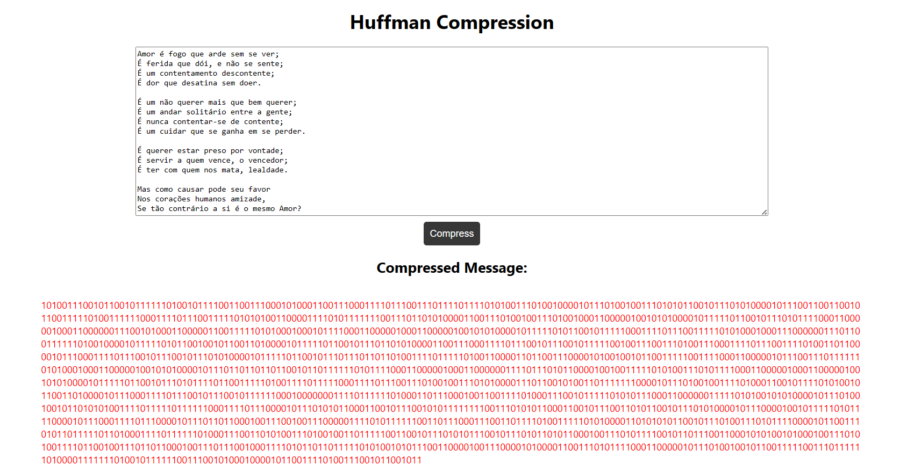

# Compressor de Strings

**Número da Lista**: 3<br>
**Conteúdo da Disciplina**: Algoritmos Gulosos<br>

## Alunos

| Matrícula  | Aluno                       |
| ---------- | --------------------------- |
| 19/0013354 | Gabriel Luiz de Souza Gomes |
| 19/0086521 | Eduardo Rodrigues Farias    |

## Sobre

Este projeto apresenta uma ferramenta para compactação de strings, possibilitando a "codificação" de mensagens de forma que ocupem menos espaço de memória e armazenamento.

## Screenshots



## Instalação

**Linguagem**: Python<br>
**Framework**: React e FastAPI<br>

## Uso

Deve-se ter instalado o Docker

Comandos:
Na pasta raiz execute

```
docker compose up --build
```

Abra o navegador e acesse o endereço http://localhost:5173/

## Vídeo de apresentação

O vídeo se encontra na pasta "assets" - .
<video src="./assets/Greed_HuffmanCompression.mp4" controls title="Vídeo de Apresentação - Compressão de Huffman"></video>
